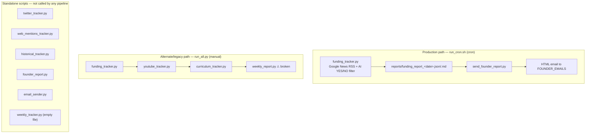
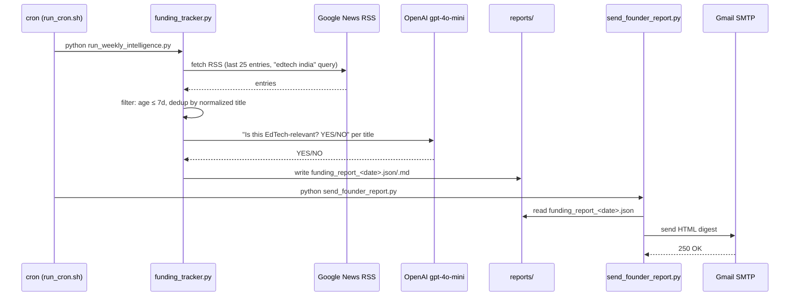

# Competition Tracker

Automated competitive-intelligence pipeline that monitors DevOps/Cloud training competitors and the broader Indian EdTech ecosystem, and emails a founder-facing intelligence report on a schedule.

> **Documentation note:** this repository had no README prior to this document. Everything below was written from a direct read of the source (all `*.py` scripts, `data/`, `reports/`, `run_cron.sh`, `.env` keys, and `cron.log`) — nothing here is assumed or invented. Where the code is incomplete, broken, or unused, that is called out explicitly rather than glossed over.

---

## Table of Contents

- [What this is](#what-this-is)
- [Architecture](#architecture)
- [Repository layout](#repository-layout)
- [Tech stack](#tech-stack)
- [Setup](#setup)
- [Environment variables](#environment-variables)
- [Running it](#running-it)
- [Module reference](#module-reference)
- [Data model](#data-model)
- [Reports directory](#reports-directory)
- [Known issues & gaps](#known-issues--gaps)
- [Possible next steps](#possible-next-steps)

---

## What this is

A small collection of Python scripts, run from cron, that answer one recurring question for a DevOps/Cloud training business: **"What did our competitors do this week?"**

It watches two overlapping spaces:

1. **Named competitors** in [`data/competitors.json`](data/competitors.json) — DevOps/Cloud training providers (AWS Cloud Institute, Scaler, Edureka, Intellipaat, KnowledgeHut, KodeKloud, independent YouTube educators, etc.) — tracked by website headings, Twitter/X activity, and YouTube uploads.
2. **The broader Indian EdTech market** — funding rounds, acquisitions, IPOs, and product launches — surfaced via Google News RSS and (in the more advanced variant) Inc42/YourStory/Entrackr feeds, filtered with an LLM relevance check.

The output is a Markdown/JSON report per signal, optionally rolled into a single weekly digest and emailed to a founder distribution list.

The recipient list embedded in the code (`send_founder_report.py`) references `microdegree.work` addresses, indicating this is an internal tool for that team.

> **Status, for a director/CTO skim:** this is unhardened internal automation, not a production service. It has no tests, no CI, no structured logging, no alerting on failure, and — as detailed below — its actual production entry point (`run_weekly_intelligence.py`) can silently email a stale report if the fetch step fails. Treat it as a useful but unattended script, not a system with an SLA.

## Architecture

Two independent pipelines exist side by side in this repo. Only one of them is actually wired into the production cron job.





## Repository layout

```
competition-tracker/
├── run_cron.sh                    # entry point invoked by cron (Linux/production)
├── run_weekly_intelligence.py     # production pipeline: funding_tracker -> send_founder_report
├── run_all.py                     # alternate manual pipeline (4 scripts; currently crashes, see Known issues)
├── funding_tracker.py             # Google News RSS -> AI-filtered EdTech funding/news report
├── founder_report.py              # more advanced funding tracker (multi-source, impact scoring) — not wired into any pipeline
├── curriculum_tracker.py          # scrapes competitor landing-page H1/H2s, diffs against last snapshot
├── twitter_tracker.py             # per-competitor Twitter/X updates via nitter.net RSS — not wired into any pipeline
├── youtube_tracker.py             # per-competitor new-upload check via YouTube RSS feeds
├── web_mentions_tracker.py        # per-competitor Google News mention search — not wired into any pipeline
├── historical_tracker.py          # trend/intensity scoring helpers, used only by founder_report.py
├── weekly_report.py               # rolls funding/youtube/curriculum reports into one digest — ⚠ has a syntax error, does not run
├── weekly_tracker.py              # empty file (0 bytes) — dead placeholder
├── email_sender.py                # plain-text email sender — depends on env vars not present in .env, unused by any pipeline
├── send_founder_report.py         # HTML email sender used by the production pipeline
├── requirements.txt               # pinned Python dependencies
├── data/
│   ├── competitors.json           # competitor registry (name, type, website, twitter, youtube, linkedin)
│   └── curriculum_snapshot_*.json # dated snapshots of scraped competitor page headings
├── reports/                       # generated output (json + markdown), one set per run date
├── cron.log                       # accumulated stdout/stderr from past cron runs
├── funding_tracker.pycrontab      # (empty) — likely a discarded crontab export
├── .env                           # secrets: OPENAI_API_KEY, SMTP_EMAIL, SMTP_PASSWORD (not committed values)
└── venv/                          # local virtualenv (should not be version-controlled — see Known issues)
```

## Tech stack

| Concern | Library | Notes |
|---|---|---|
| RSS/Atom parsing | `feedparser` 6.0.12 | Google News, YouTube, Twitter (via nitter), Inc42/YourStory feeds |
| HTML scraping | `beautifulsoup4` 4.14.3 | Curriculum heading extraction, full-article text (partially unused) |
| HTTP client | `requests` 2.32.5 | Used by `curriculum_tracker.py`; referenced but **not imported** in `founder_report.py` |
| LLM relevance filtering | `openai` 2.24.0 (`gpt-4o-mini`) | Binary YES/NO relevance classification for news titles |
| Config | `python-dotenv` | Loads `.env`; **listed in code but missing from `requirements.txt`** |
| Email | `smtplib` (stdlib) | Gmail SMTP over SSL (port 465), app-password auth |
| Data interchange | `json` (stdlib) | All snapshots and reports have a JSON twin |

## Setup

```bash
# 1. Create and activate a virtualenv
python3 -m venv venv
source venv/bin/activate        # Linux/macOS
# venv\Scripts\activate         # Windows

# 2. Install dependencies
pip install -r requirements.txt
pip install python-dotenv       # required by every entry point but missing from requirements.txt — see Known issues

# 3. Create .env (see Environment variables below)
```

## Environment variables

Read directly from the scripts. Only `OPENAI_API_KEY`, `SMTP_EMAIL`, and `SMTP_PASSWORD` currently have keys present in the local `.env`.

| Variable | Used by | Purpose |
|---|---|---|
| `OPENAI_API_KEY` | `funding_tracker.py`, `founder_report.py` | Auth for the `gpt-4o-mini` relevance filter |
| `SMTP_EMAIL` | `send_founder_report.py` | Gmail sender address |
| `SMTP_PASSWORD` | `send_founder_report.py` | Gmail app password |
| `SENDER_EMAIL` | `email_sender.py` | **Not set in `.env`** — this script is currently non-functional |
| `APP_PASSWORD` | `email_sender.py` | **Not set in `.env`** |
| `RECIPIENT_EMAIL` | `email_sender.py` | **Not set in `.env`** |

The recipient list for the production email is a hardcoded `FOUNDER_EMAILS` list inside `send_founder_report.py` itself (not an environment variable, and not `founder_report.py` despite the similar name) — most entries are commented out, leaving a single active recipient (`habin936@gmail.com`), with a `DEV_MODE` flag that can redirect everything to a separate `DEV_EMAIL` instead.

## Running it

**Production pipeline** (what cron actually runs — see `run_cron.sh`):

```bash
python run_weekly_intelligence.py
# -> funding_tracker.py         (fetch + AI-filter + write reports/funding_report_<date>.json/.md)
# -> send_founder_report.py     (email the JSON report as HTML)
```

Scheduled via cron by pointing at `run_cron.sh`, which `cd`s into `/root/competition-tracker`, activates `venv`, and runs the pipeline above. There is no crontab file committed (`funding_tracker.pycrontab` is empty) — the schedule itself is configured on the host, not in this repo.

**Individual scripts** (each is independently runnable and writes into `reports/` / `data/`):

```bash
python funding_tracker.py         # EdTech news -> reports/funding_report_<date>.{json,md}
python curriculum_tracker.py      # scrape + diff competitor pages -> data/curriculum_snapshot_<date>.json, reports/curriculum_changes_<date>.md
python youtube_tracker.py         # new competitor uploads -> reports/youtube_report_<date>.json
python twitter_tracker.py         # competitor tweets via nitter.net -> reports/twitter_report_<date>.{json,md}
python web_mentions_tracker.py    # competitor name + event-keyword news search -> reports/web_mentions_report_<date>.json
```

**Manual bundled pipeline** (`run_all.py`) chains `funding_tracker.py` → `youtube_tracker.py` → `curriculum_tracker.py` → `weekly_report.py`. This currently **fails** on the last step — see [Known issues](#known-issues--gaps).

## Module reference

### `funding_tracker.py` — production news fetcher
Queries Google News RSS for `edtech india OR online education india OR education startup india OR edtech funding india` (last 7 days), takes the first 25 entries, drops anything older than 7 days or a near-duplicate title (normalized to its first 6 non-stopword words), then asks `gpt-4o-mini` a strict YES/NO relevance question per title (`AI_FILTER = True`). Writes both a JSON array and a human-readable Markdown digest to `reports/funding_report_<date>.{json,md}`.

### `founder_report.py` — richer, unwired funding tracker
A more elaborate rewrite of the same idea: pulls from Inc42, YourStory, and an Entrackr Google News search; applies sector + business-event keyword gates *before* the AI check (cheaper); extracts funding amount/stage via regex, converts `$`/`₹` amounts to a numeric value, classifies event type (`Funding`, `M&A`, `IPO`, `Layoffs`, `Product Launch`, `Strategic Partnership`, …) and impact (`HIGH`/`MEDIUM`/`LOW`). Imports helpers from `historical_tracker.py` (`update_history`, `calculate_intensity_score`, `detect_trend`, `calculate_market_heat_index`) but never calls them. Not referenced by `run_all.py`, `run_cron.sh`, or `run_weekly_intelligence.py` — it appears to be a work-in-progress successor to `funding_tracker.py` that was never cut over.

### `curriculum_tracker.py` — competitor page-structure diffing
Fetches `h1`/`h2` text from a hardcoded list of 8 competitor URLs, checks for keyword presence (`gen ai`, `ai`, `cloud`, `devops`, `microservices`, `kubernetes`), and diffs the new heading set against the most recent `data/curriculum_snapshot_*.json` (sorted lexicographically by filename, so by date). Writes a new dated snapshot plus a Markdown change report. Note: its competitor URL list is a separate hardcoded dict, not read from `data/competitors.json`.

### `twitter_tracker.py` — competitor tweet monitor
Reads competitors from `data/competitors.json`, pulls each one's timeline via `https://nitter.net/<handle>/rss`, filters to the last 7 days, drops retweets/replies, and keeps only tweets containing a strategic keyword (`launch`, `partnership`, `investment`, `acquisition`, …). **Depends on `nitter.net`**, a public Nitter instance — these have a history of going offline or rate-limiting; expect this to be the most fragile script in the repo.

### `youtube_tracker.py` — competitor upload monitor
Reads competitors from `data/competitors.json`, pulls each channel's upload feed via YouTube's public RSS endpoint, filters to the last 7 days. Writes JSON only (no Markdown), despite an older `reports/youtube_report_*.md` file existing from a prior version of this script that did write Markdown.

### `web_mentions_tracker.py` — competitor name + event search
Builds a Google News RSS query of `"<competitor name>" (launch OR launched OR ... OR acquisition)` per competitor and saves any hits from the last 7 days. JSON output only.

### `historical_tracker.py` — trend/scoring helpers
Pure functions, no `if __name__` entry point: `update_history` (appends a weekly summary — event/funding/corporate-action/high-impact counts — to `reports/historical_events.json`), `calculate_intensity_score` (weighted sum by event type), `detect_trend` (week-over-week delta in plain English), `calculate_market_heat_index` (funding events + Twitter/YouTube activity volume). Only imported by `founder_report.py`, which never calls any of them.

### `weekly_report.py` — digest roller (currently broken)
Intended to concatenate the day's funding/YouTube/curriculum reports into `reports/weekly_founder_report_<date>.md` with an executive-highlights header. See [Known issues](#known-issues--gaps) — it does not currently run.

### `weekly_tracker.py`
Empty file. No content.

### `email_sender.py` — plain-text email sender (unused)
Reads `reports/weekly_founder_report_<date>.md` and emails it as plain text via `SENDER_EMAIL`/`APP_PASSWORD`/`RECIPIENT_EMAIL`. None of these three variables are present in `.env`, and no pipeline calls this script — `send_founder_report.py` (HTML, JSON-based) is what's actually used in production.

### `send_founder_report.py` — production email sender
Reads `reports/funding_report_<date>.json`, renders each item into an HTML `<p>` block, and sends via Gmail SMTP SSL to a hardcoded recipient list (`DEV_MODE` toggle switches between `FOUNDER_EMAILS` and a single `DEV_EMAIL`).

### `run_all.py` / `run_weekly_intelligence.py`
Two different orchestrators — see [Architecture](#architecture). `run_weekly_intelligence.py` is what `run_cron.sh` actually invokes in production.

## Data model

`data/competitors.json` is the shared competitor registry consumed by `twitter_tracker.py`, `youtube_tracker.py`, and `web_mentions_tracker.py` (but **not** `curriculum_tracker.py`, which hardcodes its own URL list). Each entry:

```json
{
  "Scaler Academy": {
    "type": "Live Cohort",
    "website": "https://www.scaler.com/courses/devops-and-cloud/",
    "curriculum_url": "https://www.scaler.com/courses/devops-and-cloud/",
    "twitter": "scaler_official",
    "youtube": "UCJskGeByzRRSvmOyZOz61ig",
    "linkedin": "https://www.linkedin.com/company/scaleracademy/"
  }
}
```

`twitter`/`youtube`/`linkedin` may be `null` when a competitor doesn't have — or hasn't had one filled in for — that channel (e.g. independent YouTube educators with no Twitter presence).

## Reports directory

Every tracker writes into `reports/`, named `<report-type>_<YYYY-MM-DD>.{json,md}`. JSON is the durable/queryable form; Markdown is the human-readable form (where produced). Existing files show output has been generated for dates between 2026-03-02 and 2026-04-02.

| File pattern | Producer | Format |
|---|---|---|
| `funding_report_<date>.{json,md}` | `funding_tracker.py` | both |
| `curriculum_changes_<date>.md` | `curriculum_tracker.py` | md only (raw headings live in `data/curriculum_snapshot_<date>.json`) |
| `twitter_report_<date>.{json,md}` | `twitter_tracker.py` | both |
| `youtube_report_<date>.json` | `youtube_tracker.py` | json only |
| `web_mentions_report_<date>.json` | `web_mentions_tracker.py` | json only |
| `weekly_founder_report_<date>.md` / `founder_weekly_report_<date>.md` | `weekly_report.py` (historical runs, two different past versions) | md only |
| `historical_events.json` | `historical_tracker.py` | json only, append-only |

The two differently-ordered filenames (`weekly_founder_report_*` vs. `founder_weekly_report_*`) both exist in `reports/` — they come from two different past revisions of `weekly_report.py`'s output path, from before it broke (see below).
